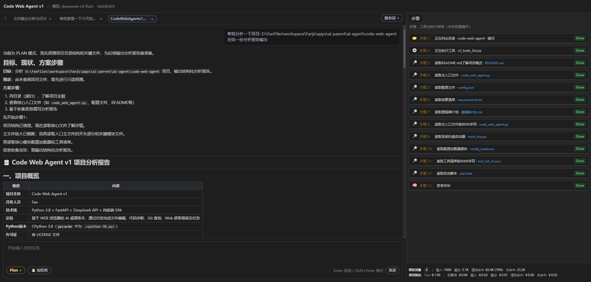
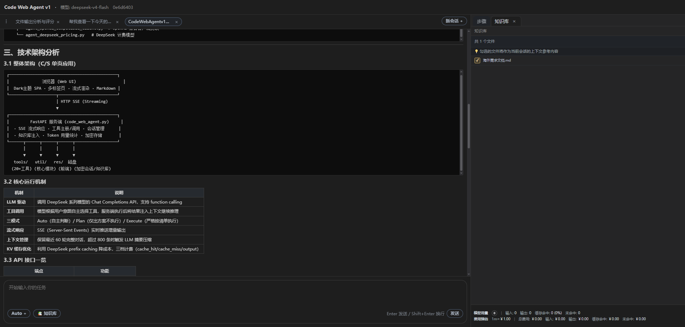
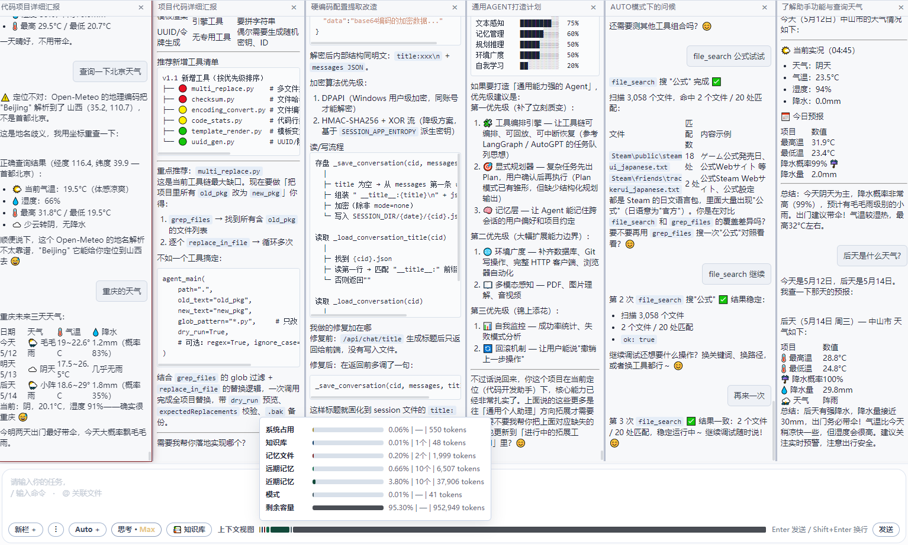
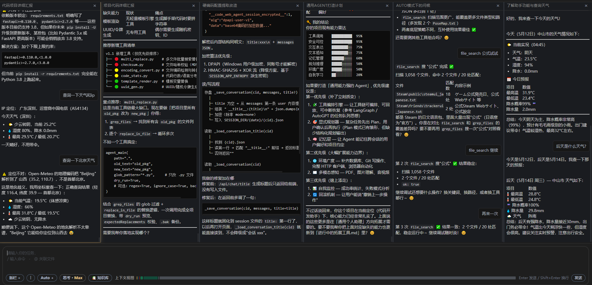
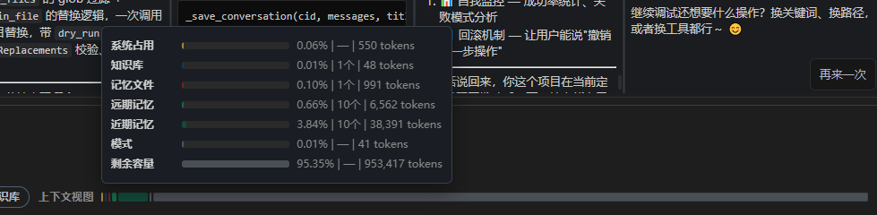

# DeepSeek Code Agent v1.3

> 基于 WEB 浏览器的 AI 桌面助手，内嵌丰富工具，通过对话完成文件编辑、代码诊断、Git 查询、Web 抓取、多 Agent 协同等复杂任务。

---

## 快速开始

```bash
# 1. 安装依赖
pip install -r requirements.txt

# 2. 配置 config.ini（填写 API Key 和端口）

# 3. 启动
#    Windows：双击 start.bat
#    Linux：  chmod +x start.sh && ./start.sh
#    或直接： python deepseek_code_agent2.py
```

启动后浏览器访问 `http://127.0.0.1:8801` 打开主界面；多列沉浸布局访问 `http://127.0.0.1:8801/immersive`。

### 界面截图











---

## 使用方式

### 💬 基础对话

直接在输入框输入问题，AI 会调用工具完成任务：

> "读取桌面的 test.txt 文件内容"
> "帮我查一下 8.8.8.8 的 IP 归属地"
> "当前目录有哪些文件？"

### 🔄 模式切换

| 命令 | 模式 | 用途 |
|------|------|------|
| 输入 `/plan` | Plan 模式 | 先输出方案，**不执行任何写操作**，适合复杂任务先审后做 |
| 输入 `/execute` | Execute 模式 | 严格按照已创建的 Todo-List 执行，每步完成后自动勾选 |
| 默认（不输入命令） | Auto 模式 | AI 自主评估→出方案→执行，适合日常对话 |

也可点击界面顶部的 Auto / Plan / Execute 按钮切换。

### 📎 引用本地文件（@）

在输入框中用 `@` 后跟文件路径，AI 会自动读取文件内容：

> `@C:\project\main.py 帮我分析这个文件的代码质量`
> `@D:\config.json 检查配置是否正确`

路径支持绝对路径和相对路径，也可以点击输入框旁的 📁 按钮打开文件浏览器选择。

### 📚 知识库

将常用文档放入知识库目录，对话时勾选即可让 AI 参考：

1. 在 `config.ini` 的 `[knowledge_base]` 节中配置 `dir`（如 `D:/AI_DATA_ROOT/knowledge_base`）
2. 往该目录放入待参考的文件（如 `.md`、`.txt`、`.py`、`.json`、表格类等）
3. 在界面右侧「📚 知识库」面板勾选本次对话需要的文件（勾选时校验单文件大小等，见 `config.ini` 中 `max_file_size`）
4. AI 自动将可读内容作为参考上下文

> 知识库目录下列出所有普通文件；勾选时再做是否可用等校验。

### 📋 Todo-List（执行清单）

在 Plan 模式下，AI 会自动创建 Todo-List。你也可以手动要求：

> "帮我列出今天要做的事情清单"

清单会在界面右侧「📋 Todo List」面板显示，每完成一项自动勾选。

### 📂 文件浏览

点击输入框旁的 📁 按钮打开文件浏览器，可以：

- 浏览本地文件系统
- 选择文件后自动插入 `@路径` 到输入框
- 支持 Windows 盘符列表

### 🛑 停止生成

如果 AI 正在生成回答或调用工具，点击输入框旁的停止按钮即可中断，不会影响已有对话历史。

---

## 目录结构

```
deepseek-code-agent/
├── deepseek_code_agent2.py     # v2 入口（FastAPI 装配）
├── agent_v2/                   # v2 业务与 HTTP 模块
├── deepseek_code_agent.py      # v1 原版（保留参考，默认不再启动）
├── main_tray.py                # 系统托盘启动器（加载 v2）
├── config.ini                  # 配置文件（API Key / 端口 / 路径）
├── requirements.txt            # Python 依赖
├── start.bat                   # Windows 一键启动（自动提权 + ACL 防篡改）
├── start.sh                    # Linux/macOS 一键启动
├── README.md                   # 完整项目指南
├── 版本日志.md                 # 版本演进历史
├── 里程碑计划.md               # 版本演进与路线图
├── 项目安全分析报告.md         # 数据安全分析
│
├── res/
│   ├── html/agent-ui.html / agent-immersive.html
│   ├── css/、js/、img/
│       ├── app_icon_128x128.png
│       └── app_icon_16x16.png
│
├── tools/           # 内置工具（见 tools/tool_list_agent.json）
│   ├── read_file.py / write_file.py / replace_in_file.py / apply_patch.py
│   ├── grep_files.py / glob_files.py / run_command.py / python_inline.py
│   ├── tool_list_agent.json
│   └── ...
│
└── util/            # 核心模块
    ├── config_loader.py
    ├── agent_prompt_constants.py
    ├── agent_model_dispatch.py
    ├── agent_openai_compatible_client.py
    └── agent_deepseek_pricing.py
```

---

## 配置说明

```ini
[model]
api_base_url = https://api.deepseek.com
api_key = sk-你的API密钥

[server]
port = 8801

[workspace]
dir = D:/workspace
runtime_data_root = D:/AI_DATA_ROOT

[knowledge_base]
dir = D:/AI_DATA_ROOT/knowledge_base
```

| 配置节 | 键 | 说明 | 必填 |
|--------|----|------|------|
| `[model]` | `api_key` | API 密钥 | **必填** |
| `[server]` | `port` | 服务端口 | **必填** |
| `[model]` | `api_base_url` | API 地址，默认 DeepSeek | 可选 |
| `[workspace]` | `dir` | 默认工作目录 | 可选，默认桌面 |
| `[workspace]` | `runtime_data_root` | 运行时数据目录（日志、会话缓存、待办清单等） | 可选，默认 `~/AI_DATA_ROOT` |
| `[knowledge_base]` | `dir` | 知识库目录 | 可选 |
> 优先级：`config.ini` > 环境变量 > 代码默认值

---

## 界面功能

| 区域 | 功能 |
|------|------|
| 💬 对话区 | 发送消息，AI 流式回复，支持 Markdown 渲染 |
| 📋 Todo List 面板 | 显示/跟踪执行清单进度 |
| 📂 步骤侧栏 | 每次工具调用的入参、结果、预览 |
| 📚 知识库面板 | 勾选本地文件注入到对话上下文 |
| 📁 文件浏览器 | 浏览文件系统，@引用文件 |
| 🔄 模式切换 | Auto / Plan / Execute 三种模式 |
| 📊 用量统计 | Token 消耗与费用统计 |
| 📑 多标签页 | 同时管理多个会话 |
| 🌓 主题 | 浅色 / 深色切换 |
| 🪟 沉浸模式 | 访问 `/immersive` 多列并排会话 |
| 📈 上下文条 | 输入区旁展示上下文占用概览 |
| 📹 视频生成 | 可灵 Kling AI 文生视频/图生视频/多镜头/运镜控制，异步查询与自动归档 |

---

## 核心特性

- **多 Agent 协同**：可创建多个 AI 助手分工协作，互发消息接力执行，形成高效协作流水线
- **上下文分层管理**：对话、工具、摘要等分区管理，界面实时可视化各层监控，完全掌控 token 用量分布
- **KV 缓存优化**：充分利用 DeepSeek prefix caching，有效降低使用成本
- **加密存储**：对话数据加密保存，保障隐私安全
- **ACL 防篡改**：防止项目文件被意外篡改

---

## API 接口

| 端点 | 用途 |
|------|------|
| `GET /api/events/stream` | 页面级全局 SSE 通道，所有会话事件通过 `conversation_id` 分发 |
| `POST /api/chat/send` | 提交用户消息并后台启动对应会话运行 |
| `POST /api/chat/user-confirm` | 提交人类确认并后台恢复对应会话运行 |
| `POST /api/chat/stop` | 停止当前生成 |
| `POST /api/chat/title` | 自动生成会话标题 |
| `GET /api/chat/history` | 获取对话历史 |
| `GET /api/chat/sessions` | 获取所有会话列表 |
| `GET /api/kb/files` | 列出知识库文件 |
| `GET /api/kb/checked` | 查看当前勾选的知识库文件 |
| `PUT /api/kb/checked` | 保存勾选状态 |
| `GET /api/model-pricing` | 查询模型费用 |
| `GET /api/usage-accumulator` | 查看用量统计 |
| `GET /api/dir-browse` | 浏览文件目录 |
| `GET /health` | 健康检查 |

---

## 常见问题

| 问题 | 原因 | 解决 |
|------|------|------|
| 启动报错 `PORT 未设置` | config.ini 缺少端口 | 在 `[server]` 节配置 `port` |
| 页面打不开 | 服务未启动或端口被占用 | 检查控制台日志，确认端口未被占用 |
| API 返回 502 | API Key 无效或网络不通 | 检查 `CHAT_API_KEY` 和网络连接 |
| Linux 下 `./start.sh` 无法运行 | 文件无执行权限 | 执行 `chmod +x start.sh` |
| 模型不调用工具 | 模型不支持 function calling | 切换到 DeepSeek-v4 系列 |
| 退出后项目目录无法保存文件 | 非正常退出，ACL 锁残留 | 重新运行 start.bat 启动一次再退出即可解锁 |

---

> 文档版本：v1.2  |  更新于：2026-05-16  |  作者：Fan
